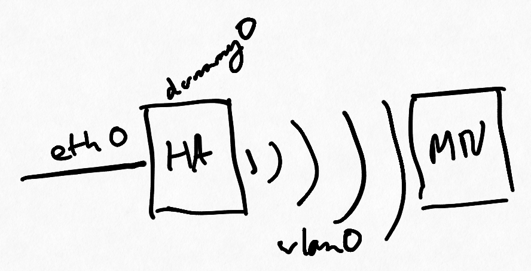

\newpage

# Vue d'ensemble



Nous avons eu deux raspberry Pi 3B+.

Notre installation consistait à brancher un des raspberry à une connexion filaire (Ethernet) et d'en faire un point d'accès Wi-Fi.
Ce raspberry jouera le rôle du *Home Agent* (HA).

L'autre raspberry, qui jouera le rôle de *Mobile Node* (MN), était connecté en Wi-Fi au premier.

# Système

On a fait le choix de partir sur une version d'Ubuntu Server 19.10 en 64 bits pour ARM, afin d'avoir un support 64 bits et des paquets assez récents.

Afin de disposer des fonctionnalités de mobilité IPv6, on a dû recompiler le noyau.
L'installation du système de base ainsi que la démarche pour recompiler le noyau et le mettre en place sont décrits en annexe.

On a écrit un *playbook* Ansible afin de configurer rapidement et de manière reproductible les raspberry Pi.
Y sont notamment configurés : la connectivité, la résolution DNS, le serveur DHCP, `radvd`, … que nous allons voir en détails dans les points suivants.

On a ensuite compilé UMIP pour avoir `mip6d` et ainsi pouvoir le lancer.

# Connectivité

La connectivité vers Internet était assuré en dual-stack sur le HA à travers la connexion filaire (`eth0`).
Il obtient son adresse IP via DHCP/SLAAC.

Le HA faisait office de NAT grâce à des règles `iptables`, ce qui permettait d'assurer également une connectivité derrière ce NAT pour le MN.

Le HA et le MN sont connectés en Wi-Fi (`wlan0`) sur le préfixe `fd01::/64` que nous avons choisis.
C'est le HA qui joue le rôle de point d'accès (avec `hostapd`) et possède les IP `192.168.142.1/24` et `fd01::1/64` sur `wlan0`.

**Configuration `/etc/hostapd/hostapd.conf` (HA):**

```ini
interface=wlan0
ssid=Noisette

driver=nl80211
hw_mode=g
channel=6
auth_algs=1
wpa=0
beacon_int=100
dtim_period=2
max_num_sta=255
rts_threshold=2347
fragm_threshold=2346
```

Une interface `dummy0` a été configurée sur le HA afin de servir le préfixe du *Home Network* (HN) qui est `fd02::/64`.

Les interfaces `eth0` et `wlan0` sont configurés avec `netplan` et `dummy0` avec `systemd-networkd`.

Le MN va également avoir une adresse IP du HN via le tunnel qui aura été créé avec `mip6d` (voir plus loin).

# Résolution DNS

Concernant la résoution DNS, nous avons mis en place `bind9` pour gérer une zone `.corp`, afin de pourvoir accéder directement aux machines avec leur nom (`home-agent` et `mobile-node`).

Il est configuré pour *forwarder* les autres requêtes vers les serveurs de Cloudflare `1.1.1.1` et `1.0.0.1`.

# Serveur DHCP

Le paquet `isc-dhcp-server` a été installé sur le HA afin d'avoir un serveur DHCP.

**Configuration `/etc/dhcp/dhcpd.conf` (HA):**

```sh
default-lease-time 600;
max-lease-time 2592000;

subnet 192.168.142.0 netmask 255.255.255.0 {
  range 192.168.142.10 192.168.142.254;
  option subnet-mask 255.255.255.0;
  option broadcast-address 192.168.142.255;
  option routers 192.168.142.1;
  option domain-name-servers 192.168.142.1;
  option domain-name "corp";
}

use-host-decl-names on;

host home-agent {
  hardware ethernet b8:27:eb:25:05:81;
  fixed-address 192.168.142.1;
}

host mobile-node {
  hardware ethernet b8:27:eb:62:3c:58;
  fixed-address 192.168.142.2;
}
```

# Router Advertisement

Le paquet `radvd` a été installé sur le HA afin d'émettre des *Router Advertisement* (RA) périodiquement et de répondre aux *Router Solicitation* (RS) avec des RA.

On a également configuré le flag pour le *HomeAgent* (on était d'abord partis sur une instalation avec `dnsmasq` mais il n'était pas possible d'activer ce flag, c'est pour cette raison que nous avons basculés sur `radvd`).

**Configuration `/etc/radvd.conf` (HA):**

```sh
interface wlan0 {
  AdvSendAdvert on;

  prefix fd01::/64 {
    AdvOnLink on;
    AdvRouterAddr on;
  };

  RDNSS fd01::1 {};
  DNSSL corp {};
};

interface dummy0 {
  AdvSendAdvert on;
  MaxRtrAdvInterval 3;
  MinRtrAdvInterval 1;
  AdvIntervalOpt on;
  AdvHomeAgentFlag on;
  AdvHomeAgentInfo on;
  HomeAgentLifetime 1800;
  HomeAgentPreference 10;

  prefix fd02::1/64 {
    AdvOnLink on;
    AdvAutonomous on;
    AdvRouterAddr on;
  };
};
```

# UMIP

Pour l'installtion d'UMIP, voir la partie `Récupérer UMIP` de l'annexe 1.

On a dû patcher UMIP pour arriver à le compiler correctement (voir le patch en annexe 3).

Le tout semble fonctionner convenablement, car depuis mip6d on peut inspecter la liste des préfixes, le *binding cache*, la liste des *home address*, la liste des *binding update*, … comme on peut le voir ci-dessous :

```sh
mip6d> pl # prefix list
dummy0 fd02:0:0:0:0:0:0:1/64
 valid 86399 / 86400 preferred 14400 flags OAR
mip6d> bc # binding cache
hoa fd02:0:0:0:0:0:0:42 status registered
 coa fd01:0:0:0:ba27:ebff:fe62:3c58 flags AH--
 local fd02:0:0:0:0:0:0:1
 lifetime 85957 / 86396 seq 7909 unreach 0 mpa 199 / 636 retry 0
mip6d> hal # home address list
dummy0 fd02:0:0:0:0:0:0:1
 preference 10 lifetime 1800
mip6d> bul # binding update list
== BUL_ENTRY ==
Home address    fd02:0:0:0:0:0:0:42
Care-of address fd01:0:0:0:ba27:ebff:fe62:3c58
CN address      fd02:0:0:0:0:0:0:1
 lifetime = 86396,  delay = 82076000
 flags: IP6_MH_BU_HOME IP6_MH_BU_ACK
 ack ready
 lifetime 85914 / 86396 seq 7909 resend 0 delay 82076(after 81595s)
 mps 77279 / 77758
```

***Configuration `/usr/local/etc/mip6d.conf` (HA):***

```sh
NodeConfig HA;

Interface "dummy0";

UseMnHaIPsec disabled;
KeyMngMobCapability disabled;

DefaultBindingAclPolicy allow;
```

***Configuration `/usr/local/etc/mip6d.conf` (MN):***

```sh
NodeConfig MN;

UseMnHaIPsec disabled;
KeyMngMobCapability disabled;
OptimisticHandoff disabled;
DoRouteOptimizationCN disabled;
DoRouteOptimizationMN disabled;

UseCnBuAck enabled;

Interface "wlan0" {
  MnIfPreference 1;
}

MnHomeLink "wlan0" {
  HomeAgentAddress fd02::1;
  HomeAddress fd02::42/64;
}
```

Nous avons également capturé le trafic pour voir différents messages intéressants :

- *Binding Update*

- *Binding Acknowledgement*

```default
Frame 4: 94 bytes on wire (752 bits), 94 bytes captured (752 bits)
Ethernet II, Src: Raspberr_25:05:81 (b8:27:eb:25:05:81), Dst: Raspberr_62:3c:58 (b8:27:eb:62:3c:58)
Internet Protocol Version 6, Src: fd02::1, Dst: fd01::ba27:ebff:fe62:3c58
    0110 .... = Version: 6
    .... 0000 0000 .... .... .... .... .... = Traffic Class: 0x00 (DSCP: CS0, ECN: Not-ECT)
    .... .... .... 0100 0000 1100 1111 1001 = Flow Label: 0x40cf9
    Payload Length: 40
    Next Header: Routing Header for IPv6 (43)
    Hop Limit: 64
    Source: fd02::1
    Destination: fd01::ba27:ebff:fe62:3c58
    [Destination SA MAC: Raspberr_62:3c:58 (b8:27:eb:62:3c:58)]
    Routing Header for IPv6 (Type 2 Routing)
        Next Header: Mobile IPv6 (135)
        Length: 2
        [Length: 24 bytes]
        Type: Type 2 Routing (2)
        Segments Left: 1
        Reserved: 00000000
        Address[1]: fd02::42
    Mobile IPv6
        Payload protocol: No Next Header for IPv6 (59)
        Header length: 1 (16 bytes)
        Mobility Header Type: Binding Acknowledgement (6)
        Reserved: 0x00
        Checksum: 0x4fd8
        Binding Acknowledgement
            Status: Binding Update accepted (0)
            0... .... = Key Management Compatibility (K) flag: No Key Management Mobility Compatibility
            .0.. .... = Mobile Router (R) flag: No Mobile Router Compatibility
            ..0. .... = Proxy Registration (P) flag: No Proxy Registration
            ...0 .... = TLV-header format (T) flag: No TLV-header format
            .... 0... = Bulk-Binding-Update flag (B): Disabled bulk binding update support
            Sequence number: 7909
            Lifetime: 21599 (86396 seconds)
        Mobility Options
            MIPv6 Option - PadN
                Length: 2
                PadN: 0000
```

- *Router Solicitation*

- *Router Advertisement*

Ainsi qu'observer l'encapsulation d'IPv6 dans de l'IPv6 :

```default
Frame 94: 126 bytes on wire (1008 bits), 126 bytes captured (1008 bits)
Ethernet II, Src: Raspberr_62:3c:58 (b8:27:eb:62:3c:58), Dst: Raspberr_25:05:81 (b8:27:eb:25:05:81)
Internet Protocol Version 6, Src: fd01::ba27:ebff:fe62:3c58, Dst: fd02::1
Internet Protocol Version 6, Src: fd02::42, Dst: fd02::bc1c:91ff:fefb:7c46
Transmission Control Protocol, Src Port: 1234, Dst Port: 48748, Seq: 1, Ack: 184, Len: 0
```

\newpage

Annexe 1 : Installation du raspberry
==================

## Installation

Téléchargement de l'image 64 bits d'Ubuntu Server ici : https://ubuntu.com/download/raspberry-pi.

Installation de l'image sur la carte micro-SD :

- Depuis Windows : utilisation de Etcher (https://www.balena.io/etcher/)

- Depuis Linux : double clic sur l'image, et laisser l'utilitaire de GNOME restaurer l'image.

## Premier démarrage

Trouver l'adresse IP :

- lien local IPv6 en inspectant le traffic avec WireShark

- IPv4 si on se branche sur une box par exemple (avec DHCP)

Connexion en SSH (par défaut, l'image Ubuntu Server a un serveur SSH intégré, identifiants par défaut : `ubuntu` / `ubuntu`) sur l'IP trouvée.

Faire les mises à jour :

- mettre à jour le cache de `apt` : `sudo apt update`,

- mettre à jour tous les paquets : `sudo apt upgrade`

  Nécessite qu'Ubuntu finisse de faire toutes les mises à jour de sécurité, ce qui peut prendre un peu de temps.
  Pour suivre l'upgrade, on peut consulter les logs : `tail -f /var/log/unattended-upgrades/*`.

Lancer le playbook Ansible pour configurer le réseau et tous les paquets nécessaires.

## Récupérer UMIP

Récupérer en local : ftp://ftp.linux-ipv6.org/pub/usagi/patch/mipv6/umip-0.4/daemon/tarball/mipv6-daemon-umip-0.4.tar.gz (car directement depuis le raspberry on a eu quelques difficultés).
Le transférer sur les deux rasp avec `scp`.
L'extraire avec `tar xzvf mipv6-daemon-umip-0.4.tar.gz` et se rendre dans le dossier extrait : `cd mipv6-daemon-umip-0.4/`.

Lancer `sudo modprobe configs` pour générer la la configuration du kernel dans `/proc/config.gz`.

En lançant `bash ./chkconf_kernel.sh` (sans `bash`, on a plusieurs erreurs en plus), pour voir si on peut builder UMIP sans soucis.

On obtient la sortie suivante :

```
Using /proc/config.gz
 Warning: CONFIG_EXPERIMENTAL should be set to y (not supported)
 Warning: CONFIG_IPV6_MIP6 should be set to y (m)
 Warning: CONFIG_XFRM_USER should be set to y (m)
 Warning: CONFIG_XFRM_SUB_POLICY should be set to y (not supported)
 Warning: CONFIG_INET6_XFRM_MODE_ROUTEOPTIMIZATION should be set to y (not supported)
 Warning: CONFIG_IPV6_TUNNEL should be set to y (m)
 Warning: CONFIG_INET6_ESP should be set to y (m)
 Warning: CONFIG_NET_KEY should be set to y (m)
 Warning: CONFIG_NET_KEY_MIGRATE should be set to y (not supported)
```

Ceux marqués avec `(m)` sont disponibles sous forme de modules.

Il faut maintenant builder les paquets pour le nouveau kernel avec les options qu'il faut.

\newpage

Annexe 2 : Noyau
=====

## Installation de la base

Installer Ubuntu Server 19.10, puis certains paquets avec :

```sh
sudo apt install debootstrap qemu qemu-user-static binfmt-support
```

Vérifier les formats d'exécutables pris en charge avec : `sudo update-binfmts --display`.

Créer un système arm64 minimal dans lequel on va `chroot` et installer `vim` avec :

```sh
sudo debootstrap \
    --variant=buildd \
    --arch arm64 eoan \
    /var/chroot/eoan http://ports.ubuntu.com
sudo chroot /var/chroot/eoan/
apt update && apt install vim
```

Éditer `/etc/apt/sources.list` pour qu'il contienne ceci :

```
deb http://ports.ubuntu.com eoan main universe restricted
deb-src http://ports.ubuntu.com eoan main universe restricted

deb http://ports.ubuntu.com eoan-updates main universe restricted
deb-src http://ports.ubuntu.com eoan-updates main universe restricted
```

Lancer `apt update` pour mettre à jour le cache de `apt`.

## Compilation du noyau

Lancer les commandes suivantes :

```sh
cd /usr/local/src/
mkdir builder
chown _apt builder
cd builder
apt source linux-image-5.3.0-1012-raspi2
cd linux-raspi2-5.3.0/
apt build-dep linux-image-5.3.0-1012-raspi2
apt install libncurses-dev flex bison openssl libssl-dev dkms \
            libelf-dev libudev-dev libpci-dev libiberty-dev \
            autoconf gcc-arm-linux-gnueabihf
export LC_ALL=C
chmod a+x debian/scripts/* debian/scripts/misc/*

./debian/rules editconfigs
#  » Do you want to edit config: armhf/config.flavour.raspi2? [Y/n] n
#  » Do you want to edit config: arm64/config.flavour.raspi2? [Y/n] y

#     Networking support ->
#       Networking options ->
#         PF_KEY MIGRATE
#         Transformation sub policy support

dpkg-buildpackage -a arm64
```

## Récupération du kernel et transfert sur les raspberry

Récupérer les fichiers .deb qui se trouvent désormais dans le dossier parent

(`scp "ludovic@metis:/var/chroot/eoan/usr/local/src/builder/*.deb" .`)

et les transférer sur les deux raspberry Pi.

Installer les deb: `dpkg -i *.deb`

Fixer les versions avec :

```sh
sudo apt-mark hold \
  linux-buildinfo-5.3.0-1012-raspi2 \
  linux-modules-5.3.0-1012-raspi2 \
  linux-tools-5.3.0-1012-raspi2 \
  linux-headers-5.3.0-1012-raspi2 \
  linux-raspi2-headers-5.3.0-1012 \
  linux-image-5.3.0-1012-raspi2 \
  linux-raspi2-tools-5.3.0-1012
```

Et rebooter les raspberry.

Lancer à nouveau : `sudo modprobe configs` et `bash ./chkconf_kernel.sh`.

On obtient la sortie suivante :

```
Checking kernel configuration...
Using /proc/config.gz
 Warning: CONFIG_EXPERIMENTAL should be set to y (not supported)
 Warning: CONFIG_IPV6_MIP6 should be set to y (m)
 Warning: CONFIG_XFRM_USER should be set to y (m)
 Warning: CONFIG_INET6_XFRM_MODE_ROUTEOPTIMIZATION should be set to y (not supported)
 Warning: CONFIG_IPV6_TUNNEL should be set to y (m)
 Warning: CONFIG_INET6_ESP should be set to y (m)
 Warning: CONFIG_NET_KEY should be set to y (m)

Above 7 options may conflict with MIPL.
If you are not sure, use the recommended setting.
```

Le diff suivant https://github.com/torvalds/linux/commit/4c145dce26013763490df88f2473714f5bc7857d#diff-1108143834f27094c161049925222ab6 nous montre que `CONFIG_INET6_XFRM_MODE_ROUTEOPTIMIZATION` est désormais disponible sous le flag `CONFIG_IPV6`.

Le flag `CONFIG_EXPERIMENTAL` n'est pas nécessaire.

Il suffit de charger les modules restants avec :

```sh
sudo modprobe mip6
sudo modprobe af_key
sudo modprobe esp6
sudo modprobe xfrm_user
sudo modprobe ip6_tunnel
sudo modprobe ip6_vti
```

Installer les paquets suivants, avec : `sudo apt install build-essential automake flex bison indent`

Une fois dans le dossier `mipv6-daemon-umip-0.4`, patcher UMIP avec notre patch `umip.patch` qui aura été déposé quelque part sur le raspberry qu'on applique avec `patch -p1 < CHEMIN_VERS/umip.patch`.

Lancer ensuite les commandes suivantes pour installer UMIP :

```sh
rm config.guess configure # pour forcer automake à les recréer
autoreconf
automake -a
./configure --with-builtin-crypto
make -j4 # pour utiliser les 4 coeurs CPU
sudo make install
```

Si tout est bon, on devrait pouvoir afficher l'aide d'UMIP et obtenir quelque chose de similaire :

```sh
> mip6d --help

Usage: mip6d [options]
Options:
  -V, --version            Display version information and copyright
  -?, -h, --help           Display this help text
  -c <file>                Read configuration from <file>

 These options override values read from config file:
  -d <number>              Set debug level (0-10)
  -l <file>                Write debug log to <file> instead of stderr
  -C, --correspondent-node Node is CN
  -H, --home-agent         Node is HA
  -M, --mobile-node        Node is MN

For bug reporting, see URL:http://www.mobile-ipv6.org/bugs/.
```

\newpage

# Annexe 3 : patch d'UMIP

```diff
diff -ur mipv6-daemon-umip-0.4/libmissing/inet6_rth_getaddr.c mipv6-daemon-umip-0.4.new/libmissing/inet6_rth_getaddr.c
--- mipv6-daemon-umip-0.4/libmissing/inet6_rth_getaddr.c	2007-09-13 11:42:42.000000000 +0200
+++ mipv6-daemon-umip-0.4.new/libmissing/inet6_rth_getaddr.c	2019-11-23 15:20:15.329370000 +0100
@@ -3,6 +3,7 @@
 /* This is a substitute for a missing inet6_rth_getaddr(). */

 #include <netinet/in.h>
+#include <stddef.h>

 struct in6_addr *inet6_rth_getaddr(const void *bp, int index)
 {
diff -ur mipv6-daemon-umip-0.4/libmissing/inet6_rth_init.c mipv6-daemon-umip-0.4.new/libmissing/inet6_rth_init.c
--- mipv6-daemon-umip-0.4/libmissing/inet6_rth_init.c	2007-09-13 11:42:42.000000000 +0200
+++ mipv6-daemon-umip-0.4.new/libmissing/inet6_rth_init.c	2019-11-23 15:19:57.125444301 +0100
@@ -5,6 +5,7 @@
 #include <sys/socket.h>
 #include <netinet/in.h>
 #include <netinet/ip6.h>
+#include <stddef.h>

 #ifndef IPV6_RTHDR_TYPE_2
 #define IPV6_RTHDR_TYPE_2 2
diff -ur mipv6-daemon-umip-0.4/src/ha.c mipv6-daemon-umip-0.4.new/src/ha.c
--- mipv6-daemon-umip-0.4/src/ha.c	2007-09-13 11:42:42.000000000 +0200
+++ mipv6-daemon-umip-0.4.new/src/ha.c	2019-11-23 15:20:36.773282611 +0100
@@ -31,7 +31,6 @@
 #include <pthread.h>
 #include <errno.h>
 #include <net/if.h>
-#include <netinet/ip.h>
 #include <netinet/icmp6.h>
 #include <netinet/ip6mh.h>
 #include <sys/ioctl.h>
diff -ur mipv6-daemon-umip-0.4/src/tunnelctl.c mipv6-daemon-umip-0.4.new/src/tunnelctl.c
--- mipv6-daemon-umip-0.4/src/tunnelctl.c	2007-09-13 11:42:42.000000000 +0200
+++ mipv6-daemon-umip-0.4.new/src/tunnelctl.c	2019-11-23 15:20:54.829209137 +0100
@@ -39,7 +39,6 @@

 #include <net/if.h>
 #include <sys/ioctl.h>
-#include <netinet/ip.h>
 #include <linux/if_tunnel.h>
 #include <linux/ip6_tunnel.h>
 #include <pthread.h>
```
